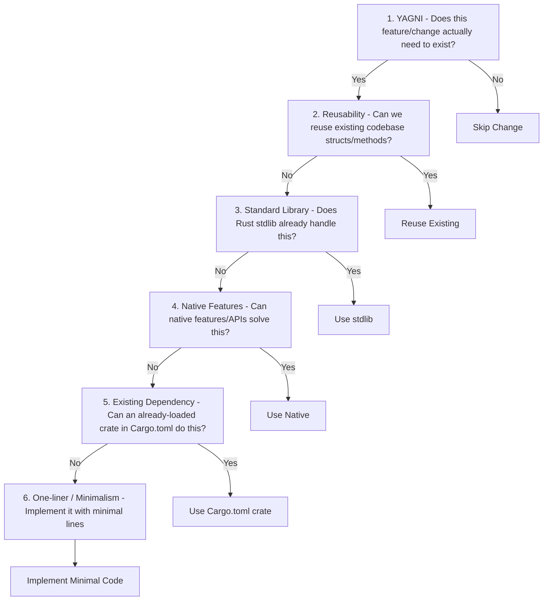

# Agent Instructions: PowerScraper Rust Development

Welcome to the **PowerScraper** codebase. This document guides AI agents (like yourself) on how to understand, modify, format, document, and test this project.

---

## 1. Project Overview & Architecture

PowerScraper is a multithreaded Rust application designed to read metrics from solar inverters and energy meters, calculate battery charge/discharge commands based on configured time periods/rules, and forward metrics to monitoring platforms (EmonCMS and InfluxDB).

The application is completely decoupled using an **MQTT-Only Inter-Task Communication** architecture:
*   **Drivers ([src/drivers/](file:///home/deece/src/PowerScraper/src/drivers/))**: Independently query inverters/meters and publish raw metrics to the MQTT broker under the `{base_topic}/{device_name}/{metric}` topic structure.
*   **Power Manager ([src/power_manager.rs](file:///home/deece/src/PowerScraper/src/power_manager.rs))**: Subscribes to status topics, tracks state, evaluates period charging logic, and publishes power rate control command payloads to `{base_topic}/{inverter_name}/command/charge_battery`.
*   **Forwarders ([src/forwarders/mod.rs](file:///home/deece/src/PowerScraper/src/forwarders/mod.rs))**: Subscribe to metrics topics, cache them in memory, and periodically flush batches to EmonCMS and InfluxDB.
*   **Concurreny Engine ([src/main.rs](file:///home/deece/src/PowerScraper/src/main.rs))**: Spawns Tokio tasks to run drivers, power management, and forwarder loops in parallel.
*   **Configuration ([src/config.rs](file:///home/deece/src/PowerScraper/src/config.rs))**: Parses TOML configurations using aliases to transparently support both kebab-case (hyphens) and snake_case (underscores) naming schemes.

---

## 2. Strict Pre-Commit Hook Requirements

This repository enforces a local Git pre-commit hook ([scripts/pre-commit](file:///home/deece/src/PowerScraper/scripts/pre-commit)). Any modifications **must** pass all of these checks:

1.  **Code Formatting**: Code must conform to standard styling. Format it using:
    ```bash
    cargo fmt
    ```
2.  **Linting**: Code must build without warnings. Turn warnings into errors during clippy runs:
    ```bash
    cargo clippy --all-targets -- -D warnings
    ```
    *Note: Crate-level style allowances are configured in [src/main.rs](file:///home/deece/src/PowerScraper/src/main.rs) to ignore styling-only rules (like collapsible ifs).*
3.  **Documentation Build**: All documentation must build cleanly without warnings or broken links:
    ```bash
    RUSTDOCFLAGS="-D warnings" cargo doc --no-deps
    ```
4.  **Tests & Code Coverage**:
    *   All unit tests must pass successfully.
    *   Line coverage thresholds are enforced:
        *   **Overall Code Coverage**: $\ge 15.0\%$
        *   **Core Logic ([src/power_manager.rs](file:///home/deece/src/PowerScraper/src/power_manager.rs)) Coverage**: $\ge 60.0\%$

---

## 3. Ponytail Prompts: Targeting Minimal Code Changes

When implementing features or bug fixes, you **must** follow the **Ponytail ruleset** (thinking like the *laziest senior developer in the room*). The core principle is: **"The best code is the code you never wrote."**

Before making any source code change, climb the **Six-Rung Laziness Ladder** and stop at the first rung that satisfies the requirement:



### The Six-Rung Ladder Rules

1.  **YAGNI (You Ain't Gonna Need It)**: Challenge the requirement itself. Can the task be skipped or simplified?
2.  **Code Reuse**: Check if existing code (e.g. helpers, structs in [src/config.rs](file:///home/deece/src/PowerScraper/src/config.rs) or [src/mqtt_helper.rs](file:///home/deece/src/PowerScraper/src/mqtt_helper.rs)) can be reused.
3.  **Language Standard Library**: Leverage Rust's native `std` library types, patterns, or macros before writing custom utility logic.
4.  **Native Platform/Language Features**: Prioritize compiler features, syntax sugars (e.g., `let-else`, `if-let` chaining), or platform conventions.
5.  **Existing Dependencies**: Reuse existing dependencies registered in [Cargo.toml](file:///home/deece/src/PowerScraper/Cargo.toml) (such as `tokio`, `chrono`, or `serde`). **Never** add new external crates unless absolutely required and approved.
6.  **Minimalist Implementation**: If code must be written, write the shortest, cleanest implementation. Prefer simple expressions and avoid unnecessary wrappers, nested levels, or boilerplate.

### Important Exception: "Lazy, Not Negligent"
You must not sacrifice program correctness or safety for brevity. **Do not** minimize or omit:
*   Trust-boundary validation (input check).
*   Correct error handling (never silently discard/suppress warnings or result errors).
*   Critical unit test assertions.
*   Required documentation comments (`///` and `//!`) for public structures and crates.

---

## 4. Documentation & Changelog Maintenance

Whenever a user-facing change is made to the codebase (e.g. adding features, updating configuration schemas, changing power manager rules, modifying dashboard panels, or creating new drivers), you **must** document it in the [Changelog.md](file:///home/deece/src/PowerScraper/Changelog.md) file:
*   Categorize modifications under standard headings: `Added`, `Changed`, `Deprecated`, `Removed`, `Fixed`, or `Security`.
*   Maintain reverse-chronological order for version entries.
*   Ensure that the changelog reflects the upcoming bumped version number.

