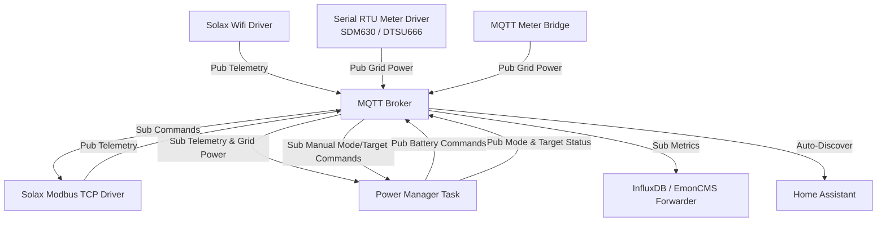

# PowerScraper Architecture & Documentation Index

PowerScraper is a multithreaded Rust application designed to optimize solar self-consumption and battery storage lifecycle. It polls SolaX solar inverters and grid/phase power meters, processes time-of-use constraints and safety bounds, dynamically manages battery charging/discharging rates, and publishes telemetry for long-term monitoring.

---

## Architectural Design

PowerScraper employs a decoupled, event-driven architecture utilizing an **MQTT Broker** as the central message bus. Rather than coupling drivers directly to control logic, all components run as independent Tokio tasks and communicate purely by publishing and subscribing to topics:

- **Inverter Drivers**: Responsible for hardware communication with SolaX inverters via HTTP or Modbus TCP. They publish inverter state (inverter power, battery voltage, temperature, battery capacity) to the broker, and subscribe to inverter charge/discharge rate commands.
- **Power Meter Drivers**: Read active/apparent/reactive power and energy metrics from physical meters (via Modbus RTU) or custom MQTT topics, publishing standard phase power telemetry.
- **Power Manager**: Subscribes to inverter state and grid/phase power readings. It evaluates the power budget and schedules time-of-use periods to calculate the ideal charge/discharge rate for each inverter, publishing instructions back to the broker.
- **Forwarders**: Subscribe to telemetry topics and write consolidated metrics to database backends like InfluxDB and EmonCMS.
- **Home Assistant**: Listens to auto-discovery topics published on startup/observation to auto-integrate all entity points.

---

## Documentation Quick Links

To explore the details of each subsystem, check the corresponding guides:

1. **[Configuration Guide](file:///home/deece/src/PowerScraper/docs/config.md)**: Details the parameters inside `config.toml`, time-of-use planning, and inverter settings.
2. **[MQTT & Home Assistant Integration](file:///home/deece/src/PowerScraper/docs/mqtt.md)**: Specifies the MQTT topics, payload shapes, and the Home Assistant auto-discovery mappings.
3. **[Inverter Drivers](file:///home/deece/src/PowerScraper/docs/inverters.md)**: Explains SolaX Modbus registers, WiFi HTTP endpoints, and hardware integration.
4. **[Power Meter Drivers](file:///home/deece/src/PowerScraper/docs/meters.md)**: Documents supported hardware meters (SDM630, DTSU666) and the MQTT meter bridge.
5. **[Power Manager Battery Control](file:///home/deece/src/PowerScraper/docs/power_manager.md)**: Outlines the battery control algorithms, period states, and safety bounds.

---

## Technical Details

- **Entrypoint**: [src/main.rs](file:///home/deece/src/PowerScraper/src/main.rs) initializes configuration, establishes connections, and spawns the Tokio tasks for each active driver and manager.
- **Shared Modules**: [src/lib.rs](file:///home/deece/src/PowerScraper/src/lib.rs) exports core drivers, helpers, and configurations for use by the daemon binary and integration tests.
- **Pre-commit Checks**: Run `./scripts/pre-commit` locally to check formatting, static clippy lints, compile docs, and run tests.
